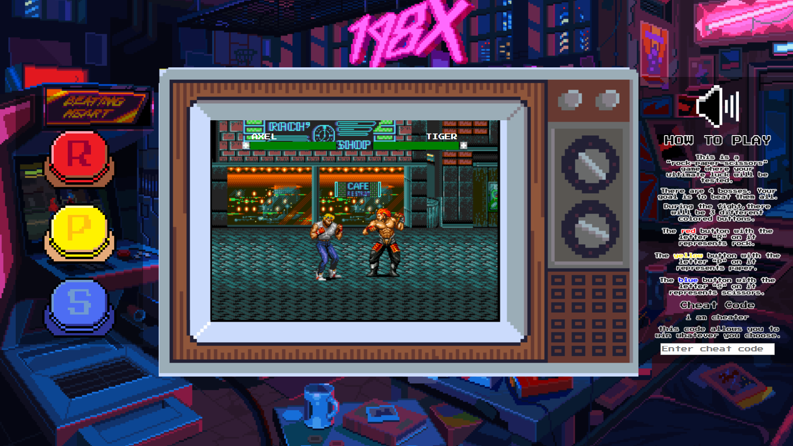

  
  
  
  

<!-- PROJECT -->
 

  
<h3 align="center">Sega Genesis Style RPS Fighting Game</h3>

  

    
I transformed the classic rock-paper-scissors game into a nostalgic, Sega Genesis-inspired, progressive fighting game. The game features 4 playable characters and 4 unique enemies to fight against. To win the game, you’ll need to use your ultimate luck to defeat all 4 enemies and complete the game. This project, created using Vanilla JS, HTML, CSS, and Bootstrap, is the first substantial software project I've developed!
     
     
    <a href="https://irfansubasi.github.io/sega-genesis-style-rps-fight-game/">View Demo</a>
  

## Built With

* 
* 
* 
* 

(<a href="#readme-top">back to top</a>)

<!-- CONTRIBUTING -->
## Contributing

Contributions are what make the open source community such an amazing place to learn, inspire, and create. Any contributions you make are **greatly appreciated**.

If you have a suggestion that would make this better, please fork the repo and create a pull request. You can also simply open an issue with the tag "enhancement".
Don't forget to give the project a star! Thanks again!

1. Fork the Project
2. Create your Feature Branch (`git checkout -b feature/AmazingFeature`)
3. Commit your Changes (`git commit -m 'Add some AmazingFeature'`)
4. Push to the Branch (`git push origin feature/AmazingFeature`)
5. Open a Pull Request

(<a href="#readme-top">back to top</a>)

<!-- LICENSE -->
## License

Distributed under the MIT License. See `LICENSE.txt` for more information.

(<a href="#readme-top">back to top</a>)

<!-- CONTACT -->
## Contact

İrfan Subaşı - [Linktree](https://linktr.ee/irfansubasi) - irfannsubasi@gmail.com

Project Link: [https://github.com/irfansubasi/sega-genesis-style-rps-fight-game](https://github.com/irfansubasi/sega-genesis-style-rps-fight-game)

(<a href="#readme-top">back to top</a>)

